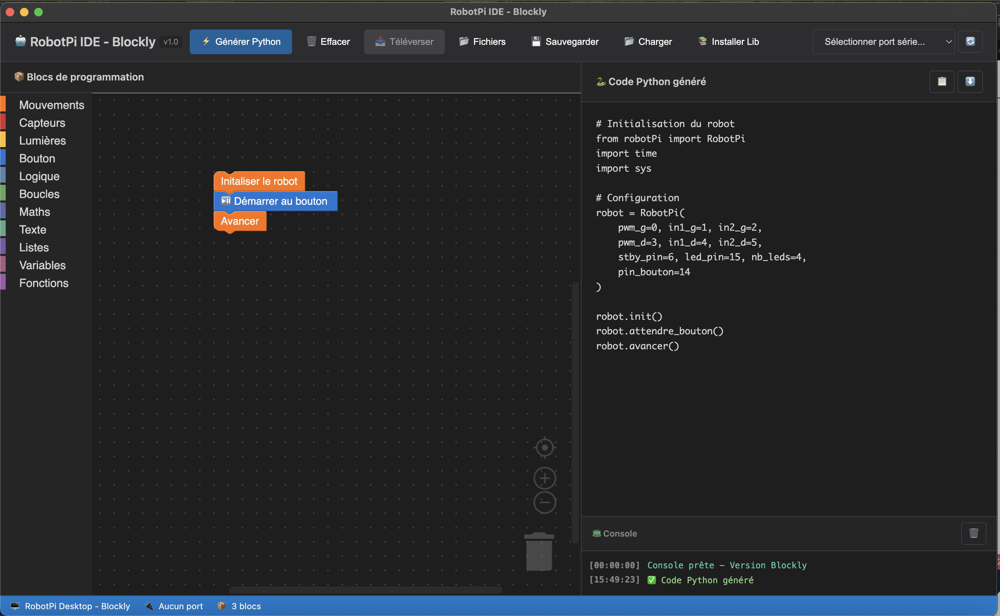

# 🤖 RobotPi IDE

> Interface de programmation visuelle pour Raspberry Pi Pico avec téléversement via ampy

[](https://opensource.org/licenses/MIT)
[](https://www.electronjs.org/)
[](https://micropython.org/)

Application desktop multiplateforme pour programmer facilement un robot mobile basé sur Raspberry Pi Pico, driver TB6612FNG et détection VL53L0X.



## ✨ Fonctionnalités

- 🎨 **Interface par blocs** type Blockly
- 🐍 **Génération de code Python** automatique
- 📤 **Téléversement direct** via ampy
- 📂 **Gestionnaire de fichiers** pour le Pico
- 💾 **Sauvegarde/chargement** de projets
- ⚙️ **Configuration des pins** GPIO
- 🔄 **Détection automatique** des Picos
- 🖥️ **Multiplateforme** : Windows, macOS, Linux

## 🎯 Blocs disponibles

## 📋 Prérequis

### Logiciels nécessaires

1. **Node.js** v16+ ([Télécharger](https://nodejs.org/))
2. **Python 3.7+** ([Télécharger](https://www.python.org/))
3. **ampy** (Adafruit MicroPython Tool)
   ```bash
   pip install adafruit-ampy
   ```

### Matériel nécessaire

- Raspberry Pi Pico avec MicroPython
- Driver moteur TB6612FNG
- 2 moteurs DC
- Châssis de robot
- Batterie (4x AA ou LiPo)
- Câbles de connexion

## 🚀 Installation

### Méthode rapide

```bash
# Cloner le dépôt
git clone https://github.com/matelec/RobotPi-IDE.git
cd RobotPi-IDE

# Installer les dépendances
npm install

# Lancer l'application
npm start
```

## 🛠️ Développement

### Structure du projet

```
RobotPi-IDE/
├── app/
│   └──js/
│       └──blockly
│           └── blocks
│               └── robotpi.js  # fichiers Blockly pour les blocs RobotPi personnalisés
│           └── generators
│               └── python.js   # fichier de génération Python pour les blocs Blockly personnalisés
│           └── toolbox.js      # fichier définissant la boîte à outils (toolbox) pour Blockly
│   └── index.html              # Interface utilisateur
│   ├── css/
│       └── style.css           # Styles
│   ├── assets/
│        └── icon.png           # Icône
├── electron/


main.js                      # Processus principal Electron
├── preload.js                   # Pont IPC sécurisé
├── package.json                 # Configuration npm


├── js/
│   ├── blockly-app.js           # Application principale
│   ├── ampy-manager.js          # Gestion ampy
│   ├── blocks.js                # Système de blocs
│   ├── blockly-generator.js     # Générateur Python
│   └── config.js                # Configuration
└── assets/
    └── icon.png                 # Icône
```